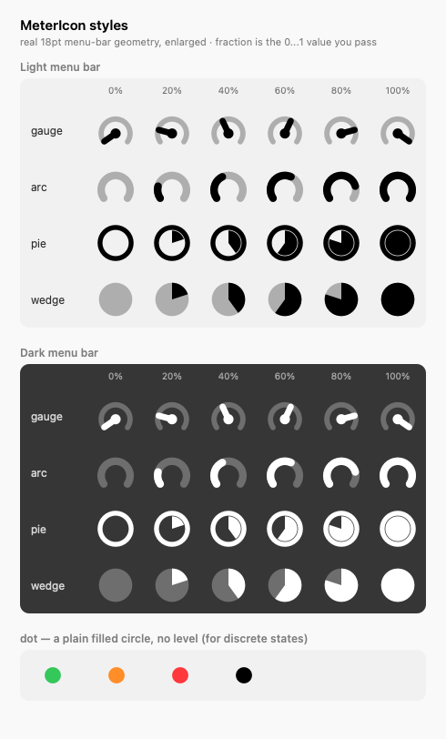

# StatusItemKit

A small, reusable framework for building **standalone macOS menu-bar apps** in
Swift — no third-party host (like SwiftBar) required. It factors out the
mechanics every such app repeats: the status-item lifecycle, a polling loop, a
lazily-rebuilt menu, a text/icon render funnel, Start-at-Login, notifications,
data-driven meter icons, and a build/sign script that produces a proper `.app`
bundle.

It's the extracted common core of several personal menu-bar apps (process
monitor, battery time, VPN/DNS status).

## Requirements

- macOS **13+** (required by `SMAppService` for Start-at-Login)
- Swift 5.9 / Xcode 15+

## What's in it

| Type | Purpose |
|------|---------|
| `Shell.run(_:_:)` | Run a CLI tool, get stdout as `String?` (nil on launch failure / non-zero exit). The one I/O primitive. |
| `StatusItemController` | Owns the `NSStatusItem`, a polling `Timer`, `.accessory` activation, and lazy menu rebuild. Constructed with `onPoll` + `onBuildMenu` closures. |
| `setTitle(_:warn:)` / `setIcon(_:)` | The render funnel — mutually-exclusive text vs. image paths, so you never get stray title spacing. |
| `MenuBuilder` | `labelWidth(...)` and a view-based `textView(...)` that escapes NSMenu's keyboard-shortcut column reservation (uses explicit frames, not auto-layout). |
| `MeterIcon` | Custom-drawn, full-color status glyphs: `dot`, and the proportional `gauge` / `arc` / `pie` / `wedge` meters (take a `0...1` fraction + color). |
| `Severity` | `level(pct:warnPct:)` → `.normal` / `.elevated` / `.high`, with a `.color`. |
| `LoginItem` | `SMAppService.mainApp` register/unregister + the "must live in /Applications" alert. |
| `Notifier` | `UNUserNotificationCenter` authorization + `post(title:body:)`. |

## Using it

Add the package. During local development against a sibling checkout:

```swift
// Package.swift
.package(path: "../StatusItemKit")
```

For a release, pin a tagged version:

```swift
.package(url: "https://github.com/nicholaspsmith/StatusItemKit.git", from: "1.0.0")
```

Then depend on the `StatusItemKit` product from your executable target.

## Minimal example

A complete, runnable example lives in
[`Sources/StatusItemKitDemo/main.swift`](Sources/StatusItemKitDemo/main.swift):
it shows a status item whose `MeterIcon.arc` sweeps green→orange→red, with a
menu that sends a test notification and toggles Start-at-Login. The essence:

```swift
import AppKit
import StatusItemKit

final class App: NSObject, NSApplicationDelegate {
    var controller: StatusItemController!

    func applicationDidFinishLaunching(_ n: Notification) {
        controller = StatusItemController(
            pollInterval: 5,
            onPoll: { [weak self] in self?.poll() },
            onBuildMenu: { [weak self] menu in self?.build(menu) }
        )
        controller.start()
    }

    func poll() {
        let pct = currentPercentage()  // your data
        controller.setIcon(MeterIcon.arc(fraction: CGFloat(pct) / 100,
                                         color: Severity.level(pct: pct, warnPct: 85).color))
    }

    func build(_ menu: NSMenu) {
        menu.addItem(NSMenuItem(title: "Quit", action: #selector(NSApplication.terminate(_:)), keyEquivalent: "q"))
    }
}
```

## Status-item icons

`MeterIcon` draws the glyph itself rather than shipping assets, so a status item
can show a live value without a single image file. Every style is drawn at 18pt,
the menu-bar glyph size.



| Style | Call | Reads as |
|---|---|---|
| `gauge` | `MeterIcon.gauge(fraction: 0.4, color: .black)` | Speedometer needle over a faint track. Distinctive, but the needle is thin — small changes are hard to see at 18pt. |
| `arc` | `MeterIcon.arc(fraction: 0.4, color: .black)` | Ring filling clockwise. The most legible at menu-bar size: the filled length reads instantly. |
| `pie` | `MeterIcon.pie(fraction: 0.4, color: .black)` | Outlined circle with a wedge filling in. Clear as a fraction, though 100% is a solid disc. |
| `wedge` | `MeterIcon.wedge(fraction: 0.4, color: .black)` | Solid disc with a wedge. Highest contrast — but note 0% is still a filled circle, so "empty" and "full" can be confused at a glance. |
| `dot` | `MeterIcon.dot(color: .systemGreen)` | No level at all — a plain filled circle for discrete states. Takes an optional `diameter` (default 10). |

`fraction` is clamped to `0...1`, so callers need not range-check.

Setting one is a single call on the controller:

```swift
controller.setIcon(MeterIcon.arc(fraction: 0.4, color: .black))
```

### Colour vs. template

These are **full-colour, non-template** images by default, which is what you want
when the colour carries meaning:

```swift
let pct = currentPercentage()
controller.setIcon(MeterIcon.arc(fraction: CGFloat(pct) / 100,
                                 color: Severity.level(pct: pct, warnPct: 85).color))
```

To instead match the standard menu-bar glyph — black in light mode, white in dark,
inverted while the menu is open — draw in black and mark it a template:

```swift
let icon = MeterIcon.arc(fraction: 0.4, color: .black)
icon.isTemplate = true
controller.setIcon(icon)
```

Template tinting uses only the drawn *alpha*, so the colour you pass is discarded;
black is simply the conventional ink. That also means the faint 28%-alpha track the
meters draw survives templating and still reads as a track. A useful pattern is to
template while the app can act, and fall back to a muted `.systemGray` full-colour
icon when it cannot — the greyed icon then reads as unavailable in both appearances.

Regenerate the image above after changing `MeterIcon`:

```sh
scripts/render-meter-icons.sh    # writes docs/meter-icons.png
```

## Building a `.app` bundle

`scripts/make-app.sh` wraps a SwiftPM executable product into an ad-hoc-signed
`.app`. Run it from your package root (it reads `./Resources/Info.plist` and
writes `./build/<DisplayName>.app`):

```sh
scripts/make-app.sh <ProductName> [<BundleDisplayName>]
# e.g.
scripts/make-app.sh StatusItemKitDemo
scripts/make-app.sh BatteryTime "Battery Time"
```

> **The `codesign` step is mandatory, not cosmetic.**
> `UNUserNotificationCenter` silently drops notification requests from unsigned
> bundles — threshold/alert notifications will appear to "not fire" if the
> signature is missing.

### Stable signing (so TCC grants survive rebuilds)

By default the bundle is **ad-hoc** signed. Ad-hoc signatures have no stable
identity, so every rebuild produces a new code hash (CDHash). macOS keys TCC
permissions — Accessibility, Screen Recording, etc. — on that hash, so an
ad-hoc app **loses its grant on every rebuild** and the user must re-approve it.
(That bites any app needing such a permission, e.g. a key-intercepting app.)

Run once to install a self-signed code-signing identity in your login keychain:

```sh
scripts/setup-signing.sh   # idempotent; creates "StatusItemKit Local Signing"
```

`make-app.sh` then signs with it automatically (precedence:
`$STATUSITEMKIT_SIGN_ID` → the `StatusItemKit Local Signing` identity → ad-hoc).
A real identity gives the bundle a stable Designated Requirement (the cert's
leaf hash, not the CDHash), so TCC honors the grant across rebuilds: approve
once, and it sticks.

Your app provides its own `Resources/Info.plist` with `LSUIElement=true` (no
Dock icon) and a real bundle identifier; use this repo's
[`Resources/Info.plist`](Resources/Info.plist) as the template.

## Development

```sh
swift test                          # unit tests (Severity, Shell, MenuBuilder, MeterIcon)
./scripts/make-app.sh StatusItemKitDemo && open build/StatusItemKitDemo.app
```

AppKit/system glue (`StatusItemController`, `LoginItem`, `Notifier`) isn't
unit-tested — it's verified by running the demo.

## License

[MIT](LICENSE)
