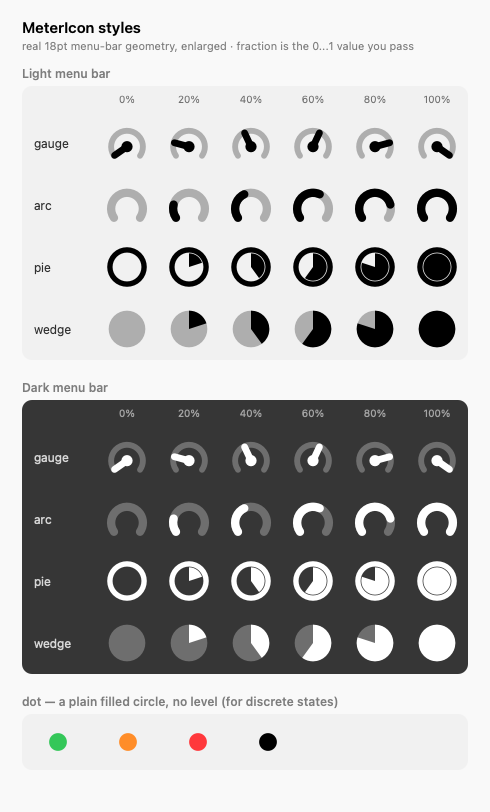

# StatusItemKit

<p align="center"></p>

<p align="center">Part of <strong><a href="https://menumon.nicksmith.software">Menumon</a></strong>.</p>

A small framework for building **standalone macOS menu-bar apps** in Swift.
It provides what every such app needs: the
status-item lifecycle, a polling loop, a lazily rebuilt menu, a text/icon
render funnel, Start at Login, notifications, data-driven meter icons, the
Menumon mascot glyphs, and a build-and-sign script that produces a proper
`.app` bundle. Every Menumon app is built on it.

## Requirements

- macOS **13+** (`SMAppService` for Start at Login)
- Swift 5.9 / Xcode 15+

## What's in it

| Type | Purpose |
|------|---------|
| `Shell.run(_:_:)` | Run a CLI tool and get stdout as `String?` (nil on launch failure or non-zero exit). The one I/O primitive. |
| `StatusItemController` | Owns the `NSStatusItem`, a polling `Timer`, `.accessory` activation and lazy menu rebuild. Constructed with `onPoll` and `onBuildMenu` closures. |
| `setTitle(_:warn:)` / `setIcon(_:)` | The render funnel: mutually exclusive text and image paths, so there is never stray title spacing. |
| `MenuBuilder` | `labelWidth(...)` and a view-based `textView(...)` that avoids NSMenu's keyboard-shortcut column (explicit frames, not Auto Layout). |
| `MeterIcon` | Full-colour status glyphs drawn in code: `dot`, `symbol` (an SF Symbol, falling back to a dot), and the proportional `gauge` / `arc` / `pie` / `wedge` meters, which take a `0...1` fraction and a colour. |
| `CharacterIcon` | The Menumon mascots as status glyphs that carry the app's data. See [Character icons](#character-icons). |
| `MinuteCue` / `IconAnimation` | The mascot animations, twice a minute, taken in turn. See [Mascot animations](#mascot-animations). |
| `MonitorLizardLap` | Monitor Lizard's full-screen lap: a 3.4 s click-through overlay in which Armonitor leaves his menu-bar slot, runs counterclockwise round the screen and returns. |
| `IllustratedIcon` | Menu-bar images from mascot art rather than code: `compose` builds a 1× + 2× non-template image from a base PNG, desaturates it, recolours a masked region keeping its shading, and draws live overlays on top; `load(named:in:)` reads a `name.png` + `name@2x.png` pair from a bundle. |
| `Severity` | `level(pct:warnPct:)` → `.normal` / `.elevated` / `.high`, each with a `.color`. |
| `MeterStyle` | The icon shapes as a value: `.arc` / `.gauge` / `.pie` / `.wedge` / `.dot`, and `.character` for the app's own mascot. `MeterIcon.image(style:fraction:color:)` draws any of them (`.character` falls back to an arc for callers that do not draw a mascot). |
| `MeterColor` | Named presets, the `#RRGGBB` round-trip used to persist a colour, and `swatch(_:)` for menu-item images. |
| `MeterAppearance` | The user's chosen shape and colour, persisted in the app's own defaults (`MeterStyle`, `MeterColorHex`). |
| `AppearanceMenu` | The shared **Icon** submenu: shapes, colour presets and the system colour picker, or an app's own colour block in their place. See [The Icon menu](#the-icon-menu). |
| `AppVersion` | The version `make-app.sh` stamped into the bundle; `menuItem()` is a disabled "Version …" row. |
| `MenuBarYield` / `YieldClient` | Lets a menu-bar manager (Barn) ask apps to hide their item briefly while it reveals hidden icons. One line opts an app in: `YieldClient(item: controller).start()`. The hide expires on its own after the TTL in the message, so a crashed manager cannot leave an icon hidden. |
| `LoginItem` | `SMAppService.mainApp` register/unregister, plus the "must live in /Applications" alert. |
| `LoginRequest` | Parses `--login [on\|off\|status]` from a command line. A bare flag or `status` only reports, so a mistyped command never changes Start at Login. Unit-tested. |
| `LoginCLI` | `runIfRequested()` acts on that flag and exits, or returns when it is absent. One line at the top of `main` gives an app a scriptable Start at Login, which is the only way an installer can turn it on: `SMAppService` registers only the calling process's own bundle. |
| `Notifier` | `UNUserNotificationCenter` authorization and `post(title:body:)`. |

## Using it

Add the package. Every Menumon app uses a sibling checkout:

```swift
// Package.swift
.package(path: "../StatusItemKit")
```

To pin a tagged version instead:

```swift
.package(url: "https://github.com/nicholaspsmith/StatusItemKit.git", from: "0.18.0")
```

Then depend on the `StatusItemKit` product from your executable target.

## Minimal example

A complete, runnable example lives in
[`Sources/StatusItemKitDemo/main.swift`](Sources/StatusItemKitDemo/main.swift):
a status item whose `MeterIcon.arc` sweeps green → orange → red, with a menu
that sends a test notification and toggles Start at Login. The essence:

```swift
import AppKit
import StatusItemKit

final class App: NSObject, NSApplicationDelegate {
    var controller: StatusItemController!

    func applicationDidFinishLaunching(_ n: Notification) {
        controller = StatusItemController(
            pollInterval: 5,
            onPoll: { [weak self] in self?.poll() },
            onBuildMenu: { [weak self] menu in self?.build(menu) }
        )
        controller.start()
    }

    func poll() {
        let pct = currentPercentage()  // your data
        controller.setIcon(MeterIcon.arc(fraction: CGFloat(pct) / 100,
                                         color: Severity.level(pct: pct, warnPct: 85).color))
    }

    func build(_ menu: NSMenu) {
        menu.addItem(NSMenuItem(title: "Quit", action: #selector(NSApplication.terminate(_:)), keyEquivalent: "q"))
    }
}
```

## Status-item icons

`MeterIcon` draws the glyph itself, so a status item can show a live value
without any image files. Every style is drawn at 18pt, the menu-bar glyph
size.



| Style | Call | Reads as |
|---|---|---|
| `gauge` | `MeterIcon.gauge(fraction: 0.4, color: .black)` | Speedometer needle over a faint track. The needle is thin, so small changes are hard to see at 18pt. |
| `arc` | `MeterIcon.arc(fraction: 0.4, color: .black)` | Ring filling clockwise. The most legible at menu-bar size. |
| `pie` | `MeterIcon.pie(fraction: 0.4, color: .black)` | Outlined circle with a wedge filling in. 100% is a solid disc. |
| `wedge` | `MeterIcon.wedge(fraction: 0.4, color: .black)` | Solid disc with a wedge. Highest contrast, but 0% is still a filled circle, so empty and full are easy to confuse. |
| `dot` | `MeterIcon.dot(color: .systemGreen)` | No level: a plain filled circle for discrete states. Optional `diameter` (default 10). |

`fraction` is clamped to `0...1`, so callers need not range-check.

### Colour vs. template

The images are **full-colour, non-template** by default, which is what you
want when the colour carries meaning:

```swift
let pct = currentPercentage()
controller.setIcon(MeterIcon.arc(fraction: CGFloat(pct) / 100,
                                 color: Severity.level(pct: pct, warnPct: 85).color))
```

To match the standard menu-bar glyph instead (black in light mode, white in
dark, inverted while the menu is open), draw in black and mark it a template:

```swift
let icon = MeterIcon.arc(fraction: 0.4, color: .black)
icon.isTemplate = true
controller.setIcon(icon)
```

Template tinting uses only the drawn alpha, so the colour you pass is
discarded, and the meters' faint 28%-alpha track still reads as a track. A
useful pattern is to template while the app can act and fall back to a muted
`.systemGray` full-colour icon when it cannot, which reads as unavailable in
both appearances.

Regenerate the image above after changing `MeterIcon`:

```sh
scripts/render-meter-icons.sh    # writes docs/meter-icons.png
```

### Character icons

`CharacterIcon` draws each app's mascot so that the glyph itself shows the
app's state. Each app offers it as `MeterStyle.character` in the Icon picker.

| Call | App | Shows |
|---|---|---|
| `owl(session:weekly:)` | Claude Usage | Archimedes: eyelids close with the session fraction; the whites go bloodshot and the pupils run green → red with the weekly fraction. |
| `iguana(tailscale:mullvad:acceptDNS:alert:lick:)` | VPN & DNS | Iguanamous on a branch: tail wrapped round it = Tailscale, tongue wrapped round it = Mullvad, cyan eye = accept-dns. Olive when nothing is connected, green when anything is, `alert` colour for Mullvad connecting or blocked. `iguana(color:tail:tongue:eyeLit:lick:)` takes the parts directly. |
| `macDaddy(art:level:asleep:flourish:grin:)` | Mac Daddy | Menu Pimp from his illustrated art (`MacDaddyArt.load(from:)`): the hat is purple when cool, amber with a sweat drop when sweating, red with two drops when red-hot; greyed with a "z" when asleep. `macDaddy(level:asleep:flourish:grin:)` is the code-drawn fallback. |
| `lumen(keycap:level:active:shimmer:)` | KeyLight | Lumen, a keycap in sunglasses from illustrated art, with eight rays drawn in code that light clockwise with the backlight level; `shimmer` sweeps a gleam round them. `key(level:active:)` is the code-drawn fallback. |
| `monitorLizard(brightness:nightShift:tongue:…)` | Monitor Lizard | Armonitor on a monitor whose screen fills blue with brightness, amber under Night Shift. |
| `caterpillar(effects:state:running:)` | SoundChain | Carol in headphones: one lit segment per running effect (up to five); colour is the state. |
| `house(lightsOn:fanOn:reachable:configured:weather:night:door:weatherPhase:intensity:)` | Homestead | Gertie, a cottage whose windows light with the lights on, a fan in one window while a fan runs, hollow when Home Assistant is unreachable, and an optional `HouseWeather` drawn around it; `door` swings the front door open a crack. `weatherPhase` (0 ..< 1 through `houseWeatherLoopDuration`) sets the weather moving — gleaming sun, drifting clouds, falling rain and snow, sliding fog, gusts, a flickering bolt — and `intensity` (0 … 1) how hard it rains or snows. |
| `menuCrane(state:)` | Menu Crane | Mendoza's head with a grab bucket: open while searching, shut on a copy, open and empty on no results. |
| `apollo(level:online:)` | Apollo Monitor | An Apollo Twin face whose knob's tick ring lights with the monitor level; dimmed when the level cannot be changed. |
| `camcorder(recording:focus:)` | MacRecorder | Manny, a camcorder whose tally light and lens turn red while recording; `focus` closes and reopens his lens's iris. |
| `octopus(fraction:)`, `raccoon(active:)`, `bin(active:)`, `battery(charge:color:)` | — | Not used by a current app: an octopus that gains arms and reddens with load, a raccoon and a wheelie bin that sleep when paused, and a battery with a face that fills with the charge (Battery Time draws its own glyph). |

Since StatusItemKit 0.18.0, `chameleon(…)` and `chameleonLickDuration` are
deprecated forwarders to `iguana(…)` and `iguanaLickDuration`.

### Mascot animations

Ten mascots animate twice a minute, on the minute and the half minute: Archimedes blinks (Claude Usage), Menu
Pimp grins with a gold gleam (Mac Daddy), Carol runs (SoundChain), Iguanamous
licks (VPN & DNS), Armonitor laps his monitor (Monitor Lizard), Volta blinks
while his charge sloshes (Battery Time), Apollo blinks (Apollo Monitor), a
gleam sweeps round Lumen's rays (KeyLight), Manny focuses his lens (MacRecorder)
and Gertie opens her front door a crack (Homestead).

`MinuteCue` keeps them from moving at once. Every app wakes on each cue (the
wall clock's :00 and :30, `MinuteCue.interval` apart) and waits one second for
each app ahead of it in `MinuteCue.order` that is running, in the order above.
No coordination is needed beyond that list: every app reads the same running
set at the same moment. The timer is re-aimed each cue and after wake or a
clock change, so it never drifts.
Everything is skipped under Reduce Motion. `IconAnimation` drives the frames
at 60 fps whether or not a menu is open.

Monitor Lizard also plays `MonitorLizardLap` at launch, when a new display
appears and when Night Shift turns on or off; his regular lap stays in
the icon (`monitorLizard(…, lap:)`).

## The Icon menu

Any app with a meter icon can offer the same picker (shape, seven colour
presets and the macOS colour panel) in three lines:

```swift
let appearance = MeterAppearance(defaultStyle: .arc)
lazy var appearanceMenu = AppearanceMenu(appearance: appearance) { [weak self] in
    self?.redraw()          // called whenever a choice changes
}

// ...while building the menu:
menu.addItem(appearanceMenu.menuItem())     // an "Icon" item with the picker under it
```

Then draw with what the user chose:

```swift
controller.setIcon(appearance.image(fraction: fraction))
// or, when the app has its own severity ramp:
controller.setIcon(MeterIcon.image(style: appearance.style, fraction: fraction, color: myColor))
```

Notes:

- **`styles:` defaults to `MeterStyle.proportional`**, which omits `.dot`: a
  dot ignores the fraction, so it cannot do a percentage icon's job. Pass
  `MeterStyle.allCases` for an app whose icon shows state rather than a level.
- **Treat `appearance.color` as the resting colour.** If your app escalates
  (`Severity`), keep your warning colours for the upper bands; a meter that
  looks the same at 5% and 95% no longer says anything.
- **An app whose colour is not one number can supply its own colour block.**
  Pass `colorItems: { submenu in ... }`; it is called after the shapes and
  their separator, in place of the presets and the panel, and the app owns
  those items' persistence and redraw.
- **An app whose colours are all data can offer none.** Pass
  `offersColour: false` and the submenu is shapes only. Claude Usage does
  this: its owl's pupils and its bars are `MeterColor.usage(fraction)`, so a
  colour preference would only contradict them.
- **The default colour is the Green preset, not `NSColor.systemGreen`.** The
  system colour is dynamic and resolves to a different hex in dark mode, so it
  would never match a preset and a fresh install would show "Custom Colour…"
  ticked.
- **Colours persist as hex**, not archived `NSColor`: readable in
  `defaults read`, stable across OS versions, and fixable by hand.
- **Retain the `AppearanceMenu`.** It is the menu items' target, and
  `NSMenuItem` does not retain its target. It releases the shared colour panel
  when the panel closes, so one app's picker cannot write into another's
  preference.

## Building a `.app` bundle

`scripts/make-app.sh` wraps a SwiftPM executable product into a signed `.app`.
Run it from your package root; it reads `./Resources/Info.plist` and writes
`./build/<DisplayName>.app`:

```sh
scripts/make-app.sh <ProductName> [<BundleDisplayName>]
# e.g.
scripts/make-app.sh StatusItemKitDemo
scripts/make-app.sh BatteryTime "Battery Time"
```

Your app provides its own `Resources/Info.plist` with `LSUIElement=true` (no
Dock icon) and a real bundle identifier; use this repo's
[`Resources/Info.plist`](Resources/Info.plist) as the template.

> **The `codesign` step is mandatory.** `UNUserNotificationCenter` silently
> drops notification requests from unsigned bundles, so notifications appear
> not to fire if the signature is missing.

### Versioning

The version comes from git, not `Info.plist`: `make-app.sh` stamps the
consuming repo's nearest `vMAJOR.MINOR.PATCH[-prerelease]` tag into the bundle
and **refuses to build without one**. In a Menumon app you don't tag by hand;
see [Releases](#releases-every-push-is-one).

| Key | Tagged, clean build | 3 commits past the tag, uncommitted edits |
|---|---|---|
| `CFBundleShortVersionString` | `1.2.0` | `1.2.0` |
| `CFBundleVersion` | `abc1234` | `abc1234.dirty` |
| `StatusItemKitVersion` | `1.2.0` | `1.2.0+3.gabc1234.dirty` |

`menu.addItem(AppVersion.menuItem())` adds a disabled "Version …" row showing
`StatusItemKitVersion`, so any two builds can be told apart from the menu.
Bump MAJOR for a breaking change in behaviour or settings, MINOR for a
feature, PATCH for a fix.

### Stable signing (so TCC grants survive rebuilds)

An ad-hoc signature has no stable identity, so every rebuild produces a new
code hash (CDHash). macOS keys TCC permissions such as Accessibility and
Screen Recording to that hash, so an ad-hoc app **loses its grant on every
rebuild**.

Run once to install a self-signed code-signing identity in your login
keychain:

```sh
scripts/setup-signing.sh   # idempotent; creates "StatusItemKit Local Signing"
```

`make-app.sh` signs with the first of: `$STATUSITEMKIT_SIGN_ID`, the
`StatusItemKit Local Signing` identity, or ad-hoc. A real identity gives the
bundle a stable Designated Requirement (the certificate's leaf hash, not the
CDHash), so a TCC grant survives rebuilds.

## Releases: every push is one

Every Menumon app (and StatusItemKit and HotkeyKit) follows one rule: **every
push is a release, and every release has a changelog entry.** Before pushing,
add a section to the top of the repo's `CHANGELOG.md`:

```markdown
## [1.3.0] - 2026-09-26
### Changed
- What changed, for someone who uses the app.
```

When it reaches `main`, GitHub tags `v1.3.0` on that commit and publishes a
GitHub Release with the section as its notes. Every guard runs
[`scripts/release/check-release.sh`](scripts/release/check-release.sh): the
section must be new, dated, non-empty and above every existing tag.

- **`.github/workflows/release.yml`** in each app calls the reusable
  [`menumon-release.yml`](.github/workflows/menumon-release.yml). (The
  deprecated `menubarn-release.yml` is a copy that still works and warns on
  every run; keep its jobs identical to `menumon-release.yml`.) It runs on every push to `main` (merged PR or direct
  push, from any machine) and does the tagging. A push without a new version
  fails the run.
- **A `pre-push` hook** refuses the push locally, before GitHub sees it.
- **Pull requests** run the same check, and branch protection on `main` makes
  it required: a PR whose `CHANGELOG.md` has no new, correctly formatted
  version **cannot be merged**, unless its tip commit says `[no release]`,
  which passes the check without a version bump (and so without a tag).

**One naming convention.** Versions are `vX.Y.Z` tags, changelog sections are
`## [X.Y.Z] - YYYY-MM-DD`, and a GitHub Release is titled with its tag,
`vX.Y.Z`, never "AppName X.Y.Z". Only the workflow makes releases; if one is
created by hand, the workflow retitles it to its tag and fails the run so it
is noticed.

Set a repo up with `scripts/release/adopt.sh` (no arguments: every Menumon app
in `~/Code`, StatusItemKit and HotkeyKit; or pass repo paths). It backfills
`CHANGELOG.md` from the existing tags, writes the workflow, points the repo's
`core.hooksPath` at `scripts/release/hooks`, and sets the branch protection
that requires `release / check` to merge (needs `gh`). It commits nothing;
commit its files with `[no release]`.

### Things to know

- **Not a release?** Put `[no release]` in the tip commit's message, for
  setup, CI, tooling or developer docs that change nothing a user runs. Every
  guard skips it, and a PR marked that way can merge without a version.
- **Never `gh pr merge --admin`.** Branch protection doesn't bind admins (so
  a direct push to `main` still works, guarded by the hook and the push job),
  which means `--admin` would force a blocked PR through. Fix the PR.
  `git push --no-verify` skips only the local hook; GitHub still checks.
- **Merge with plain `gh pr merge --merge`** once the check passes. The repos
  don't allow auto-merge, so `--auto` does nothing.
- **`## [Unreleased]`**: some changelogs were backfilled with commits made
  since the last tag. The next push turns that section into its version
  (rename the heading, add the date, reword the entries for a user).
- **Don't tag by hand.** The workflow tags; a hand-made tag for the same
  version makes the run fail. After a merge, `git pull` to fetch the tag, then
  rebuild so the menu shows a clean version instead of `+N.gSHA`.
- **The workflow uses StatusItemKit `main`.** Every app's run checks out
  StatusItemKit's `main` for `check-release.sh`, so merge a fix to the release
  scripts here before relying on it in another repo.
- **The hook is per repo, per machine.** It lives in each repo's local git
  config, not a global `core.hooksPath`, which would disable every other
  repo's own hooks. A fresh clone has no hook until it is re-armed: every
  app's `install.sh` and the macOS setup suite run
  `scripts/release/adopt.sh --hooks-only`, which you can also run by hand. The
  GitHub check applies regardless.
- **Push over SSH.** Pushing a change to `.github/workflows/` over HTTPS needs
  a token with the `workflow` scope; the SSH remotes (`git@github.com:…`) need
  nothing extra.

## Development

```sh
swift test                          # unit tests
./scripts/make-app.sh StatusItemKitDemo && open build/StatusItemKitDemo.app
```

The tests cover the pure logic: severity, shell, menu layout, meter and
character icons, illustrated icons, the Icon menu and appearance, login
parsing, the yield protocol and the minute cue. AppKit and system glue
(`StatusItemController`, `LoginItem`, `Notifier`) is verified by running the
demo.

`scripts/capture-menu.sh <ProcessName> <output.png>` captures a running app's
open menu for README screenshots (needs Accessibility and Screen Recording for
the terminal). The mascot images in each app's README and on the Menumon site
are rendered from this code by `art/glyphs/render-glyphs.sh` in the
widgets.nicksmith.software repo; run it after changing a glyph.

## The menu-bar suite

One of the two frameworks behind Menumon, a suite of macOS menu-bar apps that
share one build-and-sign script and one installer and sit in the same bar
together.

| App | What it does |
|---|---|
| [Claude Usage](https://github.com/nicholaspsmith/claude-usage-menubar) | Claude Code plan limits, resets, and live agent sessions |
| [Apollo Monitor](https://github.com/nicholaspsmith/apollo-monitor-menubar) | Apollo audio-interface monitor level |
| [Battery Time](https://github.com/nicholaspsmith/battery-time-menubar) | Time remaining, power mode, and 24h usage |
| [VPN & DNS](https://github.com/nicholaspsmith/vpn-dns-menubar) | An iguana for Mullvad + Tailscale state, with a DNS watcher |
| [Mac Daddy](https://github.com/nicholaspsmith/mac-daddy-menubar) | Kills media trackers, trashes stale downloads, reaps hung processes, watches the UA mixer engine, and sweats as your process count climbs |
| [KeyLight](https://github.com/nicholaspsmith/keylight-menubar) | Ctrl+brightness keys remapped to keyboard backlight |
| [Monitor Lizard](https://github.com/nicholaspsmith/monitor-lizard-menubar) | External-monitor brightness, contrast and resolution, Night Shift, and the built-in screen from dimmer than macOS allows to XDR |
| [Homestead](https://github.com/nicholaspsmith/home-assistant-menubar) | Home Assistant dashboards and device controls in the menu |
| [SoundChain](https://github.com/nicholaspsmith/soundchain-menubar) | One chain of Audio Unit effects over all system audio |
| [Menu Crane](https://github.com/nicholaspsmith/menu-crane) | A ⌘Space launcher for apps, arithmetic, unit conversions and emoji |
| [MacRecorder](https://github.com/nicholaspsmith/MacRecorder) | Screen recording with system audio |
| [Barn](https://github.com/nicholaspsmith/menubar-barn) | macOS 26 and earlier only: hides a block of status icons by width (on macOS 27, use System Settings ▸ Menu Bar) |

| Framework | |
|---|---|
| **StatusItemKit** | Status-item lifecycle, polling, menus, meter and mascot icons, the shared Icon picker |
| [HotkeyKit](https://github.com/nicholaspsmith/HotkeyKit) | CGEventTap engine for intercepting and remapping global keys |

Install the whole suite on a fresh Mac with
[macOS Dev Environment Setup](https://github.com/nicholaspsmith/MacOS-Dev-Environment-Setup):

```bash
git clone https://github.com/nicholaspsmith/MacOS-Dev-Environment-Setup.git
cd MacOS-Dev-Environment-Setup && ./bootstrap.sh --all
```

## License

Copyright (c) 2026 Nicholas Smith. Licensed under the
[Mozilla Public License 2.0](LICENSE). You may use, modify, sell and
redistribute this software, including inside proprietary products, provided
the copyright notice and license stay on these files and any modified
versions of them are made available under the same license.
